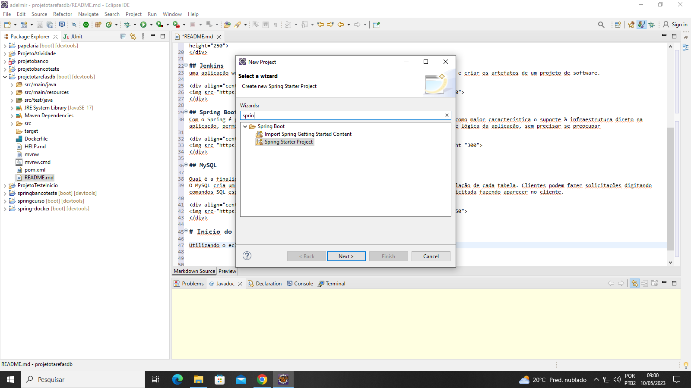
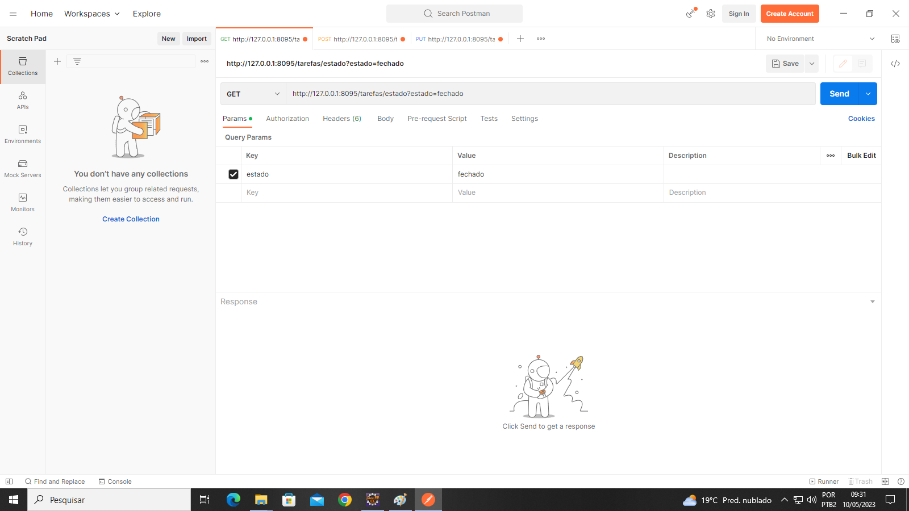
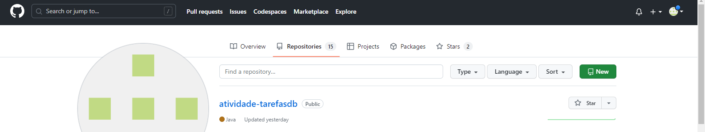
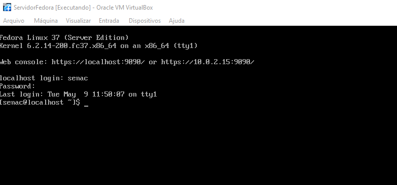
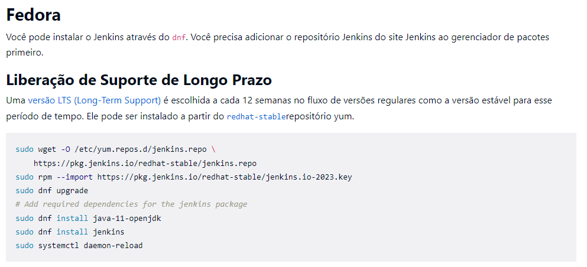
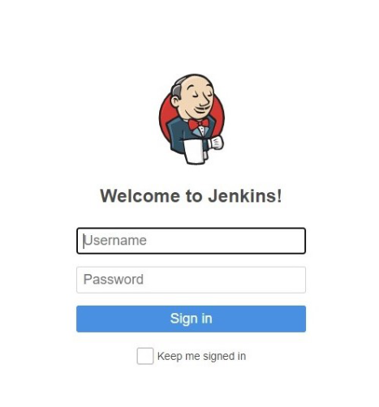

# Projeto Tarefas UC-11 

Este projeto tem por objetivo criar uma aplicação onde realizaremos processos de cadastro, listagem, busca e atualizar tarefas 
de quaisquer natureza.

Nele foi utilizado: 

#Eclipse 
um Ambiente de Desenvolvimento Integrado de código aberto e gratuito, que reúne ferramentas para apoiar o desenvolvimento de softwares em diversas linguagens de programação, como por exemplo, Java, JavaScript/TypeScript, PHP e entre outras.

## Fedora
Função, servidor utilizado para criação de containers. nele hospedamos o MySQL, Jenkins, Maven e a imagem criada neste projeto. 

## Jenkins 
uma aplicação web de Integração Contínua, serve, principalmente, para executar os testes e criar os artefatos de um projeto de software.

## Spring Boot
Com o Spring é possível ter maior domínio do projeto que está sendo desenvolvido, tendo como maior característica o suporte à infraestrutura direto na aplicação, permitindo assim que os times de desenvolvimento possam se concentrar na parte lógica da aplicação, sem precisar se preocupar

## MySQL

Qual é a finalidade do MySQL?
O MySQL cria um banco de dados para armazenamento e manipulação de dados, definindo a relação de cada tabela. Clientes podem fazer solicitações digitando comandos SQL específicos no MySQL. A aplicação do servidor responde com a informação solicitada fazendo aparecer no cliente.

## Postman

 Postman é um API Client que facilita aos desenvolvedores criar, compartilhar, testar e documentar APIs. Isso é feito, permitindo aos usuários criar e salvar solicitações HTTP e HTTPs simples e complexas, bem como ler suas respostas.
 
 

## Github 

GitHub é uma plataforma de hospedagem de código-fonte e arquivos com controle de versão usando o Git. Ele permite que programadores, utilitários ou qualquer usuário cadastrado na plataforma contribuam em projetos privados e/ou Open Source de qualquer lugar do mundo.

# Inicio do Projeto 

Utilizando o eclipse, crie um novo projeto, NEW -> Project, e utilizei o spring conforme imagem, dei um nome ao projeto e realize a configuração das dendependências de forma manual.

## Criação das classes e interface 

Dentro de src/main/java criei as classes: controller, domain e interface respository!

## Tarefasdb 

package br.com.tarefasdb;

import java.util.Collections;

import org.springframework.boot.SpringApplication;
import org.springframework.boot.autoconfigure.SpringBootApplication;

@SpringBootApplication
public class ProjetotarefasdbApplication {

	public static void main(String[] args) {
		SpringApplication app = new SpringApplication(ProjetotarefasdbApplication.class);
		app.setDefaultProperties(Collections.singletonMap("server.port","8095"));
		app.run(args);
	}

}

## Domain

package br.com.tarefasdb.domain;

import java.util.Date;

import jakarta.persistence.Column;
import jakarta.persistence.Entity;
import jakarta.persistence.GeneratedValue;
import jakarta.persistence.GenerationType;
import jakarta.persistence.Id;

@Entity
public class Tarefas {
	
	@Id
	@GeneratedValue(strategy=GenerationType.IDENTITY)
	@Column(nullable = false)
	private Integer idtarefas;
	
	@Column(nullable=false)
	private String titulo;
	
	@Column(nullable=false)
	private String descricaotarefas;
	
	@Column(nullable=false)
	private Date datainicio;
	
	@Column(nullable=false)
	private Date datatermino;
	
	@Column(nullable=false)
	private String estado;

	public Tarefas() {
	}

	public Tarefas(Integer idtarefas, String titulo, String descricaotarefas, Date datainicio, Date datatermino,
			String estado) {
		this.idtarefas = idtarefas;
		this.titulo = titulo;
		this.descricaotarefas = descricaotarefas;
		this.datainicio = datainicio;
		this.datatermino = datatermino;
		this.estado = estado;
	}

	public Integer getIdtarefas() {
		return idtarefas;
	}

	public void setIdtarefas(Integer idtarefas) {
		this.idtarefas = idtarefas;
	}

	public String getTitulo() {
		return titulo;
	}

	public void setTitulo(String titulo) {
		this.titulo = titulo;
	}

	public String getDescricaotarefas() {
		return descricaotarefas;
	}

	public void setDescricaotarefas(String descricaotarefas) {
		this.descricaotarefas = descricaotarefas;
	}

	public Date getDatainicio() {
		return datainicio;
	}

	public void setDatainicio(Date datainicio) {
		this.datainicio = datainicio;
	}

	public Date getDatatermino() {
		return datatermino;
	}

	public void setDatatermino(Date datatermino) {
		this.datatermino = datatermino;
	}

	public String getEstado() {
		return estado;
	}

	public void setEstado(String estado) {
		this.estado = estado;
	}

}

## Repository

package br.com.tarefasdb.repository;

import java.util.List;

import org.springframework.data.jpa.repository.JpaRepository;

import br.com.tarefasdb.domain.Tarefas;

public interface TarefasdbRepository extends JpaRepository <Tarefas, Integer> {
	
	public List<Tarefas> findByTitulo(String titulo);
	public List<Tarefas> findByEstado(String estado);
}

## Controller 

package br.com.tarefasdb.controller;

import java.util.List;

import java.util.Optional;

import org.springframework.beans.factory.annotation.Autowired;

import org.springframework.web.bind.annotation.GetMapping;

import org.springframework.web.bind.annotation.PathVariable;

import org.springframework.web.bind.annotation.PostMapping;

import org.springframework.web.bind.annotation.PutMapping;

import org.springframework.web.bind.annotation.RequestBody;

import org.springframework.web.bind.annotation.RequestParam;

import org.springframework.web.bind.annotation.RestController;

import br.com.tarefasdb.domain.Tarefas;

import br.com.tarefasdb.repository.TarefasdbRepository;

@RestController
public class TarefasController {
	
	@Autowired
	private TarefasdbRepository tf;
	
	@GetMapping("/tarefas/listar")
	public List<Tarefas> listar(){
		return tf.findAll();		
	}
	
	@PostMapping("/tarefas/cadastrar")
	public String cadastrar(@RequestBody Tarefas ta) {
		String msg="";
		tf.save(ta);
		msg = "Tarefa Cadastrada com Sucesso!";
		return msg;
	}
	@GetMapping("/tarefas/titulo")
	public List<Tarefas> ListarTitulo(@RequestParam String titulo){
		return tf.findByTitulo(titulo);
	}
	@GetMapping("/tarefas/estado")
	public List<Tarefas> ListarEstado(@RequestParam String estado){
		return tf.findByEstado(estado);
	}
	
	@PutMapping("/tarefas/atualizar/{id}")
	public String atualizar(@PathVariable Integer id, @RequestBody Tarefas tarefas) {
		String msg ="";
		Optional<Tarefas> t = tf.findById(id);
		
		if(t.isPresent()) {
			tarefas.setIdtarefas(id);
			tf.save(tarefas);
			msg = "Tarefa Atualizada";
		}
		else {
			msg = "Tarefa não encontrada";
		}
		return msg;
	}
	
}

## Configuração do Application.properties

spring.datasource.url=jdbc:mysql://172.17.0.2:3306/tarefasdb?usessl=false

spring.datasource.username=root

spring.datasource.password=senac@123

spring.jpa.properties.hibernate.dialect=org.hibernate.dialect.MySQL8Dialect

spring.jpa.hibernate.ddl-auto=update

#porta do servidor spring
server.port=8095

#este foi o código utilizado para criação da aplicação, após criado realizei testes das rotas criadas, todo um processo de validação utilizando o postman.

 

## Arquivo Dockerfile, realizei a configuração antes de subir o projeto pro github

FROM openjdk:17

EXPOSE 8095

ADD target/tarefasdb.jar tarefasdb.jar

ENTRYPOINT [ "java","-jar","tarefasdb.jar" ]

## Github
Feito a validação, subi o projeto para o github, criei um novo repositório com o nome de atividade-tarefasdb e realizei do processo para hospodedagem do nosso projeto conforme imagem

## Criando a imagem do projeto no fedora. 

Utilizando o fedora para criação a imagem e gerar o container do projeto! 

será necessário clonar o projeto para o fedora. 

git clone https://github.com/Adelmir1998/atividade-tarefasdb

## Utilizando o Maven 

Feito o clone o projeto, iremos inicializar o maven 

Mvn install 

O mesmo será instalado e configurado 

## Criando a imagem 

Para realizar a criação da imagem utilizei o seguinte comando! 

docker build -t tarefasdb . 

docker run --name tarefasdb -p 8095:8095 tarefasdb

## Validação 

Realizei novamente a validação das rotas, versão do maven e java 

# Instalação do Jenkins 

O Jenkins já estava instalando, porem o código de instalação e configuração:

 
## Portas 

Portas utilizadas 

3306 : MySQL 

8095 : Maven 

Jenkins: 8080

# Inicializando o Jenkins 

sudo systemctl start jenkins 

acessando o jenkins 

http://http://127.0.0.1:8080/

## processo de configuração do jenkins 

Feito a inicialização, realizei a configuração do jenkins 
e testes do container. 

O scrip utilizado: 

pipeline{
    agent any
    tools{
        maven 'maven_3_8_5'
    }
    stages{
        stage('Build Maven'){
            steps{
                checkout scmGit(branches: [[name: '*/main']], extensions: [], userRemoteConfigs: [[url: 'https://github.com/edilsonsilva/app-papelaria']])
                sh 'mvn clean install'
            }
        }
        stage('Gerar Docker Image'){
            steps{
                script{
                    sh 'docker build -t senac/app-papelaria .'
                    
                }
            }
        }
        stage('Gerar Container Docker'){
            steps{
                script{
                    sh 'docker run --name senac-papelaria -p 8091:8091 -d senac/app-papelaria'
                }
            }
        }
        
    }
}

## Projeto finalizado! 

 
 

 